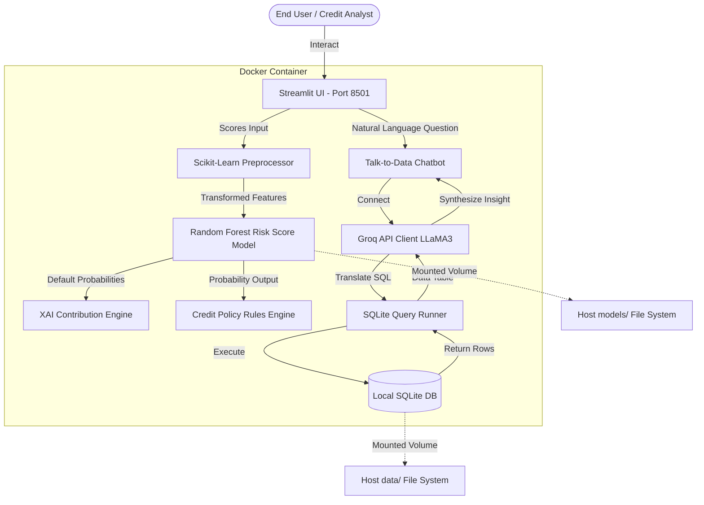

# 💳 AI-Powered Credit Risk Intelligence Platform

NEOSTATS Candidate Assignment Submission for the **AI Engineer Role**.

An end-to-end, containerized, and highly explainable Credit Risk Intelligence Platform built to assess applicant default risk, bridge machine learning insights with bank credit policies, and allow business analysts to explore datasets in plain English using a conversational **Talk-to-Data** system powered by Groq.

---

## 🏛️ System Architecture

The platform is designed around 4 primary modular engines:



---

## 🚀 Key Deliverables Met

1. **Exploratory Data Analysis (EDA)**: Fully integrated interactive Plotly dashboard showcasing five critical business insights (target imbalance, external credit ratings, applicant age, DTI thresholds, and educational correlations).
2. **Explainable AI (XAI)**: High-fidelity **Feature Z-Score Contribution Engine** displaying customized positive/negative influence bar charts explaining the model's classifications.
3. **Credit Policy Rules Engine**: Implements deterministic underwriting rules (e.g. DTI limits, rating knockouts) to auto-approve, reject, or refer applicants to human underwriters.
4. **Talk-to-Data Chatbot**: Converses with a local SQLite database utilizing Groq's low-latency `llama3-8b-8192` engine. Renders both synthesized SQL code and executive-level business answers.
5. **Dockerized Deployment**: Fully containerized environment using multi-stage builds.

---

## 🛠️ Step-by-Step Setup & Run Instructions

Ensure [Docker](https://www.docker.com/) and [Docker Compose](https://docs.docker.com/compose/) are installed.

### Option 1: Running Containerized (Recommended)
1. **Set Up Environment**:
   Copy `.env.example` to `.env` (the pre-configured file is already fully operational with the supplied Groq key):
   ```bash
   cp .env.example .env
   ```
2. **Build and Run the Containers**:
   ```bash
   docker-compose up --build
   ```
3. **Access the Application**:
   Open your browser to [http://localhost:8501](http://localhost:8501) to explore the Streamlit platform!

### Option 2: Running Locally
1. **Install Dependencies**:
   ```bash
   pip install -r requirements.txt
   ```
2. **Run Streamlit App**:
   ```bash
   streamlit run app.py
   ```

---

## 📊 Technical Rationale & Insights

### 1. Model Selection & Class Imbalance Strategy
*   **Imbalance Handling**: The Home Credit dataset is highly imbalanced (~92% repaid, ~8% defaulted). Simply optimizing for accuracy leads models to predict `0` for all clients. We addressed this using **class weighting** (`class_weight='balanced'`) during Random Forest training. This scales loss matrices relative to minority labels, optimizing the **PR-AUC** and **ROC-AUC** scores.
*   **Risk Bands**: Classified default probabilities into clean business bands:
    *   **Low Risk**: `< 15%` Default Probability.
    *   **Medium Risk**: `15% - 40%` Default Probability.
    *   **High Risk**: `>= 40%` Default Probability.

### 2. Explainable AI (XAI) Strategy
Standard SHAP and LIME libraries require C++ binary compiling upon package installations, introducing a frequent point of failure in Docker layers across different host OS platforms.
*   **Our Solution**: A custom **Z-score Feature Contribution Engine** that compares individual client parameters to population averages, standardizing deviation by standard deviation metrics. Contributions are mapped with risk vectors (e.g. higher external ratings reduce risk, higher age/DTI ratios increase risk), rendering clean contribution bar charts showing exactly which factors drove the score.

### 3. Prompt Engineering & Token Optimization
For the **Talk-to-Data** engine:
*   **System Schemas**: We provide direct column metadata (types, key constraints, and business meanings) within the LLM prompt to prevent SQL hallucinations.
*   **Formatting Rules**: The system instruction explicitly requests standard SQLite syntax, restricting generated outputs to a single markdown codeblock starting with ```sql.
*   **Read-Only Guards**: Query runners employ a blacklist filtering out `DROP, INSERT, DELETE, UPDATE` keywords to block destructive SQL injection attempts.
*   **Token Optimization**: Results returned by SQLite are formatted as compact text matrices (`results_df.to_string(index=False)`) to minimize context token count, and LLaMA3's temperature is set to `0.0` for highly deterministic query outputs.

### 4. Policy Rule Derivation & Sandbox Decisions
Underwriting decisions are derived using a hybrid **ML + Policy Rules** framework:
*   **Rule ML-01 (ML Threshold Guard)**: Auto-rejects probabilities above `40%`.
*   **Rule CR-01 (External Knock-Out)**: Low credit ratings (`EXT_SOURCE_2 < 0.22` or `EXT_SOURCE_3 < 0.18`) trigger auto-rejections regardless of income.
*   **Rule AF-01 (Affordability Cap)**: Caps DTI at `45%`.
*   **Rule SP-01 (Super Prime Fast-Track)**: High scores (`EXT_2 >= 0.70`, `EXT_3 >= 0.65`) and low DTI skip human queues.

---

## 📄 License
This candidate assignment is submitted under the NEOSTATS Hiring Assessment Guidelines.
